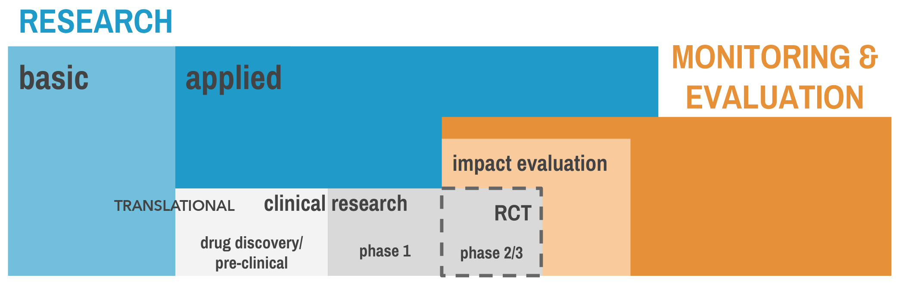

# Global Health Research {#ghr}

## What is Global Health?

*New York County Courthouse, Lower Manhattan, New York City, circa 2009*

**Judge presiding over jury selection:** And what do you do, Mr. Green?

**Me:** I do research in global health.

**Judge:**

**Me:** Access to mental health services, things like that.

**Judge:** So health policy then?

**Me:** No, studies on interventions to expand access to care.

**Judge**: All around the globe.

**Me:** No, I don't work globally.

**Judge:** What is global health, Mr. Green?

**Me:** Well, you see...*rambles*...

**Judge:** Thank you. Mr. Green, you are dismissed.

<br>

In fairness to the Honorable Judge, it's not clear what I should have expected her to imagine when I said "global health". Everyone understands medicine, and most folks probably have a good sense of what we mean by public health. But what is global health?

Maybe I would have made the cut had I said, "**global health is the study and practice of improving health and achieving equity in health for all people worldwide**". This is how Koplan et al. defined global health in a *Lancet* article published a few months after my court appearance.[@koplan:2009] They also offered this longer version:

>  **Global health** emphasises transnational health issues, determinants, and solutions; involves many disciplines within and beyond the health sciences and promotes interdisciplinary collaboration; and is a synthesis of population-based prevention with individual-level clinical care.


```marginfigure
"Determinants" of health/illness is one of those terms that you'll come across a lot in global health. It refers to the things that contribute to our health and wellbeing. Yep, pretty much everything ([http://tinyurl.com/zvdxezv](http://tinyurl.com/zvdxezv)). Ironically, despite sounding so *deterministic*, the study of determinants is mostly *probabilistic*. For instance, a social determinant like poverty is generally associated with worse health outcomes, but not everyone living in poverty is sick.  
```

This definition reflects the reality that the determinants of ill health and inequality are complex, so the search for solutions must span multiple disciplines. In the study of malaria, for example, you can read about the spread of the disease (epidemiology), the impact of illness on future productivity (economics), the merits of free or subsidized bed nets (public policy), mosquito habitats (ecology), the efficacy of vaccines to prevent the disease (medicine and statistics), rapid diagnostic tests (biomedical engineering), and the adoption and use of bed nets (psychology), just to name a few areas of inquiry.

Therefore, we say that global health research is multidisciplinary and interdisciplinary. It is **multidisciplinary** in the sense that no one field can solve the great global health challenges of our time, and **interdisciplinary** because collaboration is core to progress.[@merson:2011]

## What Makes Research Scientific?

We conduct research all the time. Your internet browser history probably has many good examples. Mine does. When was the term "AIDS" first used? How widespread is male circumcision today? Do bees poop? (I have a curious 4 year old.) But my research into the answers to these questions is not an example of scientific research. 

According to the **Common Rule**, a US federal policy that governs research with human subjects, **research** is defined as:


```marginfigure
[https://tinyurl.com/af98yyak](https://tinyurl.com/af98yyak)
```

> a systematic investigation, including research development, testing, and evaluation, designed to develop or contribute to *generalizable knowledge (Title 45, Subtitle A, Subchapter A, Part 46.102)*


```marginfigure
Global health largely focuses on applied research questions. What are risk factors for a certain disorder? Does this new treatment improve health? Unlike research questions in the natural sciences, the answers to most global health research questions are probabilistic. Uncertain. What goes up might come down, for some people. 
```

There are three main characteristics of scientific research that apply to most of global health:[@king:1994]

1. The goal is inference.
2. The procedures are public.
3. The conclusions are uncertain.

### ALL ABOUT INFERENCE

By stating that the goal of scientific research is inference, we mean that science goes beyond the collection of facts. **Inference** refers to the process of making conclusions about some unobserved or unmeasured phenomenon based on direct observations of the world. What is known is used to infer something about things that are not known. This process can be deductive or inductive. 

In **deductive** reasoning, we start from general theories and make hypotheses. Then we collect data and make conclusions based on the data. **Inductive** reasoning flows the other direction, from specific observations to the generation of hypotheses and theories. To say that quantitative research is deductive and qualitative research is inductive is not quite right, but it's often true.

The point to take away about inference is that, regardless of the approach to reasoning, the goal of scientific research is to use what we observe to make conclusions about what we do not or cannot observe directly. This is sometimes referred to as **empiricism**, and our systematic observations are **empirical evidence**. Empiricism is at the heart of scientific research.

### RESEARCH AS A PUBLIC ACT

<div class="figure">

<p class="caption">(\#fig:pancakes)A poorly documented Method section. Source: [http://tinyurl.com/yxtabza3](http://tinyurl.com/yxtabza3)</p>
</div>

Scientific research uses public methods that can be examined and replicated. A Method section in a scientific paper is like a recipe. If you have ever tried to follow a confusing recipe, you can appreciate the importance of good documentation. Your study's recipe must be clear (well written), thorough (no "dash" of this or that), and shared publicly (not a secret passed down to lab members).

**Replication** is a core principle of scientific research. No one study rules the day. If the results of a study are robust, another research group should be able to follow your recipe and replicate the findings. When such findings are replicated, we all have more confidence in the results. 

In later chapters we'll learn strategies for writing a good Method section (and appendices!) and discuss why replications are actually rare in practice—and why they can be so controversial.

### LIVING WITH UNCERTAINTY

Every method has limitations, every measurement has error, and every model is wrong to some extent. Take the estimation of maternal mortality rates as an example. @hogan:2010 published maternal mortality estimates for 181 countries. Some countries, such as the United States, have vast amounts of data in vital registries that attempt to track all births and deaths. It's not perfect, so we still estimate the maternal mortality rate using a statistical model (we'll discuss models more in a later chapter). 

As you can see in the left panel of Figure \@ref(fig:mmr), the United States has a very low level of maternal mortality, between about 10-20 maternal deaths for every 100,000 live child births. Compared to some countries, the US has a lot of data points for estimating the level and trend in maternal deaths, so the "uncertainty band" is narrow. 


Now take a look at Afghanistan on the right. Note that the y-axis scale is much larger in the 1000s, reflecting the fact that many more Afghan women die of causes related to pregnancy or childbirth. Next, pay attention to the width of the uncertainty band. It spans a range of more than 3000 deaths. Compare this to a range of fewer than 5 deaths in the US! This is because there are very few data points available to estimate the "true" value in Afghanistan, and these individual data points can differ by more than 1000 deaths. We don't know much about maternal mortality in Afghanistan, but the blue line is our best guess.


```marginfigure
Your [spidy sense](https://en.wiktionary.org/wiki/Spidey-sense) should tingle a bit when you read an article that ignores or hides uncertainty.  
```

The takeaway message is that there is uncertainty in everything. No single estimate can be considered "The Truth." Instead, we must focus on the origin of estimates and recognize the limitations of what we know or what is being reported.

## What Constitutes Global Health Research?

Global health research brings together scholars and practitioners from many different disciplines to tackle big challenges. Therefore, the methods of these disciplines *are* the methods of global health research. We can organize the landscape as shown in Figure \@ref(fig:basicapplied). 

<div class="figure">

<p class="caption">(\#fig:basicapplied)A research taxonomy</p>
</div>

Research is divided into two main categories: basic and applied. Overlapping with applied research is an area of work called "monitoring and evaluation", or M&E. Let's examine what constitutes research before turning to M&E.

### BASIC RESEARCH

**Basic research**—also known as "pure" or "blue skies" research—is the pursuit of fundamental knowledge of phenomena. For example, scientists conduct laboratory experiments to understand the parasitic life cycle and how parasites interact with humans at different stages. Another example is the scientific investigation of the properties of cancer cells to better understand how they grow and spread. 

The information generated by basic science becomes the basis for applied science. It's the "bench" in the "bench to bedside" cascade of research needed to take an idea from the lab (*the bench*) to a new medical treatment (*delivered to the patient's bedside*). 

Harvard Medical School's Rachel Wilson explains this beautifully:

> The new therapies of today were the prototypes of yesterday. And the prototypes of yesterday were previously just findings in laboratories, and before that they were just an idea. Unless we have new ideas, we're not going to have useful therapies. Great new therapies don't just fall like apples from a tree.

<iframe width="690" height="388" src="https://www.youtube.com/embed/uUnlPMeVusk" frameborder="0" allow="accelerometer; autoplay; encrypted-media; gyroscope; picture-in-picture" allowfullscreen></iframe>

### APPLIED RESEARCH

**Applied research** focuses on specific problems or real-world applications. Whereas the basic scientist might toil away in the lab to understand how cellular enzymes function without a specific clinical application in mind—discovering this function is the end goal for this scientist—the applied researcher will take this knowledge of enzymes to develop new therapies that could treat cancer.

In the world of malaria research, an applied research question might be, "How can we increase the coverage and use of bed nets that prevent malaria transmission?" The basic science, such as the behavioral habits of the mosquito and the transmission conditions for malaria, have already been characterized by entomologists and epidemiologists. 

#### Clinical Research{-}


```marginfigure
Read about Aunt Debbie's journey: [https://tinyurl.com/y5ae459m](https://tinyurl.com/y5ae459m).
```

Applied science takes many different forms, including [**clinical research**](https://en.wikipedia.org/wiki/Clinical_research). Clinical research is a broad field that encompasses patient-oriented research, epidemiological and behavioral studies, outcomes research, and health services research. Basic research provides the foundation for all clinical research.

<div class="figure">

<p class="caption">(\#fig:ctrial)Pipeline from basic research to FDA approval. Source: [http://www.phrma.org/advocacy/research-development/clinical-trials](http://www.phrma.org/advocacy/research-development/clinical-trials).</p>
</div>


```marginfigure
<iframe width="300" height="169" src="https://www.youtube.com/embed/dsfPOpE-GEs" frameborder="0" allow="accelerometer; autoplay; encrypted-media; gyroscope; picture-in-picture" allowfullscreen></iframe>What are clinical trial phases? National Cancer Institute (2016). [https://tinyurl.com/y2rur4nx](https://tinyurl.com/y2rur4nx)
```

One type of clinical research is a clinical trial. Drugs and vaccines have to pass through different phases of clinical trials before regulatory bodies, such as the Federal Food and Drug Administration (FDA), will approve their use with humans:


```marginfigure
Behavioral research (e.g., development and evaluation of parenting interventions) does not follow the same exact phases of vaccine and drug development, but the broad principles are the same.
```

<br>


