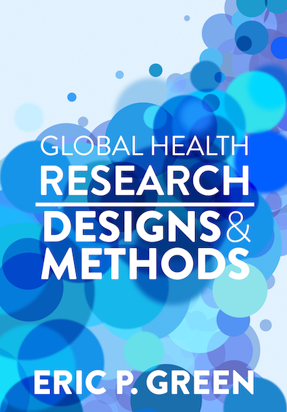

--- 
title: "Global Health Research"
author: "Eric P. Green"
date: "2021-09-01"
site: bookdown::bookdown_site
documentclass: book
bibliography: [book.bib, packages.bib, ghr.bib]
csl: apa-numeric-superscript.csl
link-citations: true
url: 'http\://themethodsection.com/ebook/'
cover-image: images/cover.jpg
description: |
  Online textbook about global health research methods
geometry: paperheight=10in,paperwidth=8in,margin=1in
papersize: justified,twoside,symmetric
---

<!-- Include welcome for html only -->

# Welcome {-}
 I'm working on a new version of this book for publication with CRC Press. New chapters will be released on a rolling basis. This work is shared under the [Creative Commons Attribution-NonCommercial-NoDerivatives 4.0 International License](https://creativecommons.org/licenses/by-nc-nd/4.0/). A big thanks to the creators of the [`bookdown`](https://github.com/rstudio/bookdown) and [`msmbstyle`](https://github.com/grimbough/msmbstyle) packages for R used to compile the web version of this book. The source code for this book is available on [Github](https://github.com/ericpgreen/ghr_book).

# Preface{-}

This book will introduce you to research designs and methods in global health. I wrote this text for undergraduate and graduate students taking my [introductory course at Duke University](http://www.globalhealthresearch.co/). Therefore, it shares the two central aims of my course: to make you a better consumer of health research, and to help you design your first global health study.

Something about global health. @white:2017 have ideas.

Part I begins with an introduction to global health research and teaches you how to identify research problems, search the literature, and practice critical appraisal. In Module 2, you'll learn how to ask evidence-based research questions, create study aims, integrate theory, and specify important constructs, outcomes, and indicators. Module 3 is all about inference: statistical inference, causal inference, and generalizability. 

We'll turn to research designs in Module 4. In global health, we are often interested in knowing what treatments, programs, interventions, and policies "work" and why. To answer questions of impact, researchers sometimes design randomized controlled trials. Randomization is not always possible or advisable, however, and researchers must build a causal argument using non-experimental designs. We'll consider the strengths and limitations of research designs most commonly used in the behavioral and social sciences, public health, and medicine.

Module 5 will help you fill in the remaining details for a Method section. In particular, you'll learn about data collection procedures and planning for data analysis. Module 6 concludes with a discussion of how to practice good science and make an impact with your work. 

One limitation of this book is it does not teach statistics. Statistical concepts are discussed throughout but not in great detail. Because statistical analysis is an intrinsic part of the study design stage, I recommend downloading a copy of [*OpenIntro Statistics*](https://www.openintro.org/stat/) and reading it alongside this book.

Visit [themethodsection.com](http://themethodsection.com/) for additional materials.
